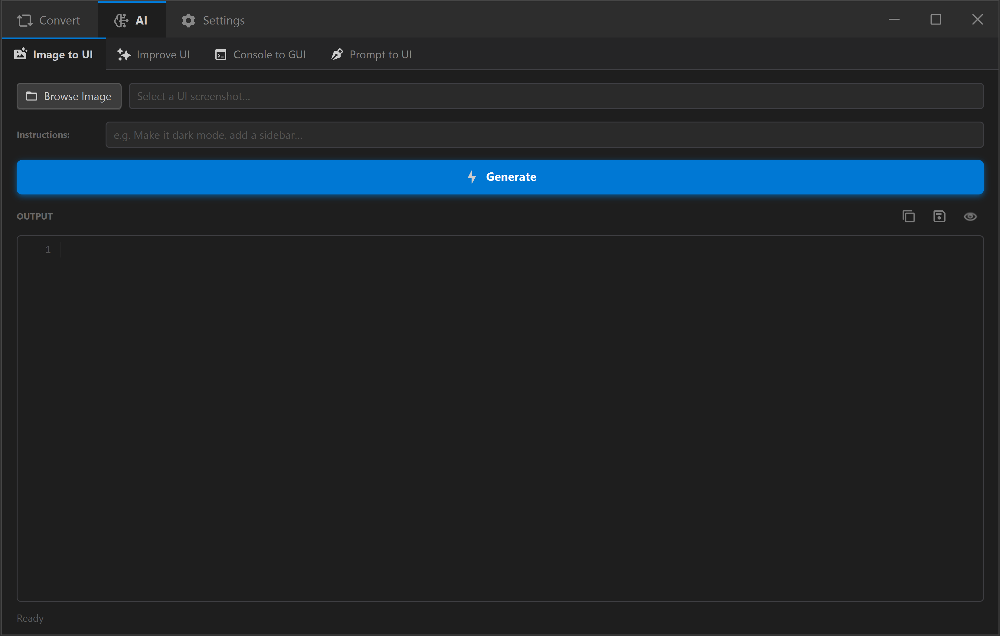
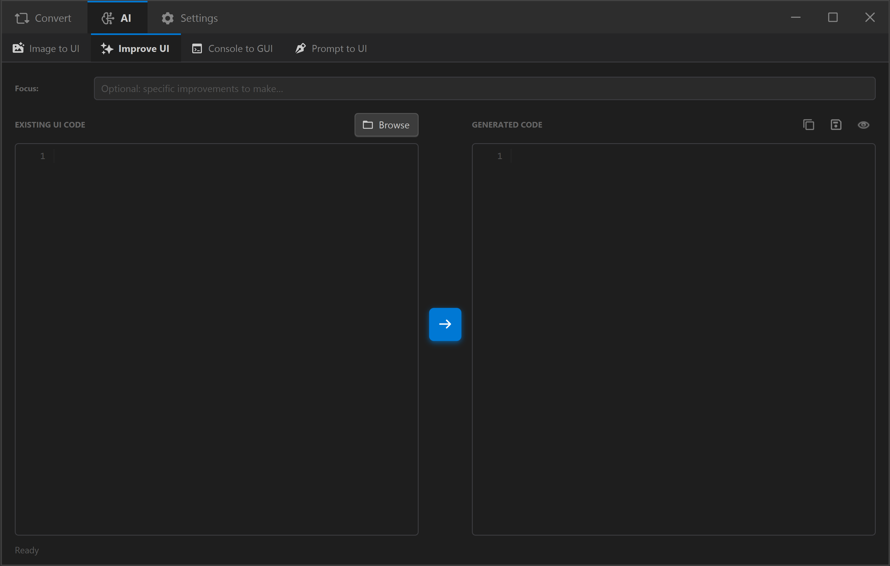
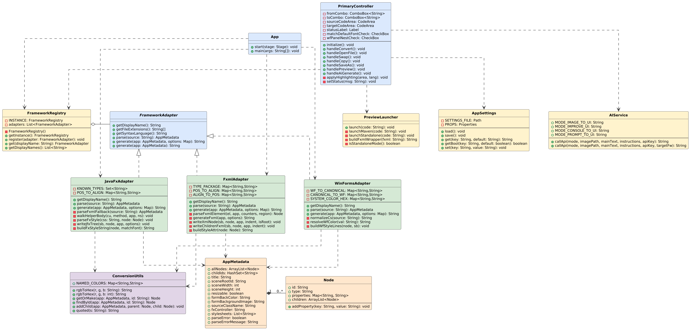

<p align="center">
  
</p>

<h1 align="center">UIPorter</h1>

<p align="center">
  <b>Convert UI code between frameworks into their native languages.</b><br>
  <sub>University Second Semester Project &nbsp;·&nbsp; Object-Oriented Programming</sub>
</p>

<p align="center">
  <a href="https://junaidirf.github.io/UIPorter/">
    
  </a>
  
  
  
  
  
</p>

---

<p align="center">
  Paste your JavaFX Java code, get clean FXML out. Or go the other way.<br>
  UIPorter handles the conversion so you don't have to rewrite it manually.
</p>

<p align="center">
  <a href="https://junaidirf.github.io/UIPorter/"><b>🌐 Visit Website</b></a> &nbsp;·&nbsp;
  <a href="../../releases/latest"><b>📦 Download</b></a> &nbsp;·&nbsp;
  <a href="submission/user-manual.md"><b>📖 User Manual</b></a>
</p>

---

<p align="center">
  <b>🎬 Video</b>
</p>

<p align="center">
  <video src="https://github.com/user-attachments/assets/b06c52c9-68b4-46da-974c-0bc70fc065a7" width="90%" controls></video>
</p>

<p align="center">
  <b>📸 Screenshots</b>
</p>

<p align="center">
  
  &nbsp;
  
</p>

---

## ✨ Features

- 🔄 **Bidirectional Code Conversion** - JavaFX Java ↔ FXML ↔ WinForms C#, in a single click
- 🧠 **AI Assistant** - Generate, improve, or convert UI code using Google Gemini
- 👁️ **Live Preview** - Compile and launch the converted JavaFX output as a real running window
- 🎨 **Syntax Highlighting** - Colour-coded Java and FXML editors powered by RichTextFX
- 📂 **File I/O** - Open `.java`, `.fxml`, `.cs` files directly; save output with the right extension
- ⇄ **One-Click Swap** - Instantly flip source and target frameworks and re-convert
- ⚙️ **Persistent Settings** - API key and preferences saved automatically to `~/.uiporter/`
- 📦 **Self-Contained** - No Java install needed to run; ships as a portable `UIPorter.exe`

---

## 🔄 Conversion Matrix

| From / To | JavaFX Java | FXML | WinForms C# |
|:---:|:---:|:---:|:---:|
| **JavaFX Java** | - | ✅ | ✅ |
| **FXML** | ✅ | - | ✅ |
| **WinForms C#** | ✅ | ✅ | - |

> Converting between **JavaFX Java ↔ FXML** is the most accurate direction - same framework, just different syntax.

---

## 🤖 AI Assistant

<p align="center">
  
  &nbsp;
  
</p>

| Mode | What it does |
|---|---|
| 🖼️ **Image → UI** | Upload a screenshot or mockup → get JavaFX/FXML code |
| 💬 **Prompt → UI** | Describe a UI in plain text → generate a full layout |
| 🖥️ **Console → GUI** | Paste a console Java app → convert it to a GUI version |
| ✨ **Improve UI** | Paste existing UI code → AI enhances styling and layout |

---

## 🚀 Getting Started

### Installation

1. Go to [**Releases**](../../releases/latest) and download the latest `UIPorter.zip`
2. Extract the zip anywhere
3. Open the `UIPorter/` folder
4. Double-click **`UIPorter.exe`** - no installation or Java setup required

> **Want to use Live Preview?**
> Preview compiles and runs real JavaFX code, so it needs a JDK installed on your system.
> Download **[JDK 25+ from Adoptium](https://adoptium.net/)** and make sure `javac` is on your PATH.
> The rest of the app works without it.

### AI Setup *(optional)*

1. Get a free API key from [Google AI Studio](https://aistudio.google.com/apikey)
2. Open UIPorter → switch to the **AI** tab
3. Paste your key into the **API Key** field - it saves automatically

---

## 🖥️ How to Use

**Converting code:**
1. Select your source framework in the **From** dropdown
2. Select the target in the **To** dropdown
3. Paste your code into the left panel (or click **Browse**)
4. Click **→** to convert
5. The converted code appears on the right with syntax highlighting
6. Click **Copy** or **Save** to use the output

**Live Preview:**
1. Convert to **JavaFX Java** or **FXML**
2. Click the **👁 Preview** button - a real window opens showing the rendered UI

**Swap direction:**
- Click the **⇄** button to instantly flip source ↔ target and re-convert

---

## 🧩 Supported Controls

| Category | Controls |
|---|---|
| **Basic** | Button, Label, TextField, TextArea, PasswordField |
| **Selection** | ComboBox, ChoiceBox, CheckBox, RadioButton |
| **Display** | ListView, TableView, TreeView |
| **Navigation** | TabPane / Tab, MenuBar / Menu / MenuItem |
| **Layout** | VBox, HBox, BorderPane, GridPane, StackPane, FlowPane, SplitPane, ScrollPane |
| **Range** | Slider, ProgressBar, ProgressIndicator, Spinner |
| **Media** | ImageView |
| **Shapes** | Rectangle, Circle, Ellipse, Line, Polygon |
| **Charts** | LineChart, BarChart, AreaChart, PieChart |
| **Other** | Accordion / TitledPane, Separator, Canvas, Tooltip, DatePicker, ColorPicker |

**Properties preserved:** text, colours, fonts, sizes, positions, padding, borders, alignment, visibility, event handlers, data lists, tree structures, table columns/rows, opacity, tooltips, inline CSS

---

## 🏗️ Architecture

UIPorter is built around an **Intermediate Representation (IR)** pattern:

```
Source Code  →  parse()  →  AppMetadata (IR)  →  generate()  →  Target Code
```

Every adapter converts *into* the neutral `AppMetadata` model first, then *out of* it.
Adding a new framework only requires writing one new adapter class, nothing else changes.

**Design patterns used:** Adapter · Singleton · Strategy · Open/Closed Principle



---

## 📋 Report & Documentation

| Document | Description |
|---|---|
| [Features & Working](submission/features-and-description.md) | What UIPorter does and how it works |
| [Algorithms & Steps](submission/algorithms-and-steps.md) | Development steps and core algorithms |
| [UML Class Diagram](submission/03-uml-class-diagram.puml) | Full class structure |
| [Use Case Diagrams](submission/04-uml-usecase-diagram.md) | All 5 use cases |
| [Sequence Diagram](submission/05-uml-sequence-diagram.puml) | Conversion flow sequence |
| [User Manual](submission/user-manual.md) | Step-by-step usage guide |
| [Limitations](submission/limitations.md) | Known limitations |
| [Addressing Limitations](submission/addressing-limitations.md) | How they are handled |

---

## 📋 Requirements

| | Requirement |
|---|---|
| **OS** | Windows 10 / 11 (64-bit) |
| **Run the app** | Nothing - JVM is bundled in the release |
| **Live Preview** | [JDK 25+](https://adoptium.net/) with `javac` on PATH |
| **AI features** | Internet connection + free [Google Gemini API key](https://aistudio.google.com/apikey) |

---

## 📝 License

This project is developed for educational purposes as part of a university OOP semester project.
