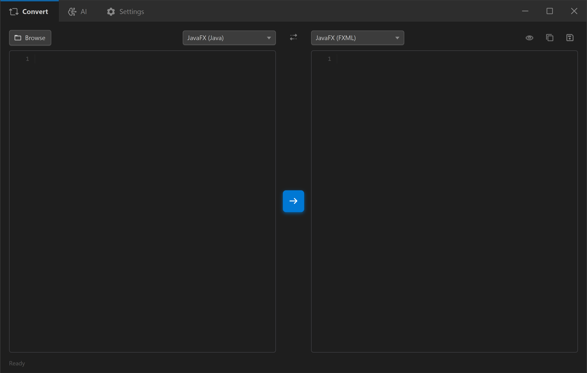
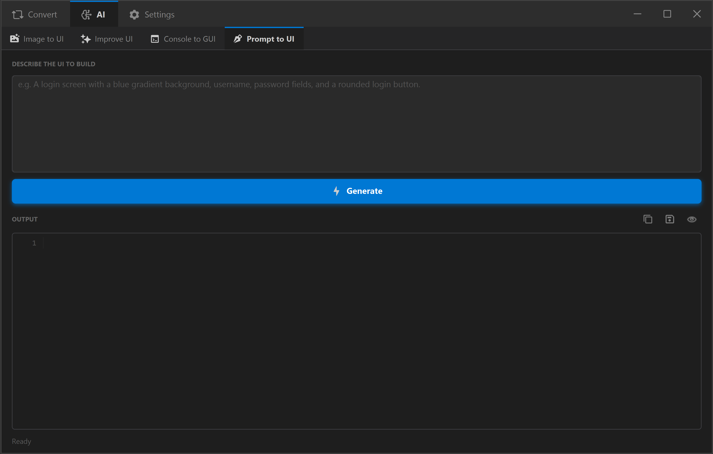

<h1 align="center">UIPorter</h1>
<h2 align="center">Object-Oriented Programming - Semester Project Report</h2>

<p align="center">
  <b>A JavaFX desktop tool that converts UI source code between frameworks automatically.</b>
</p>

---

## Table of Contents

| # | Section |
|---|---------|
| A | [Features & Working](#a-features--working) |
| B | [Development Steps, Algorithms & UML](#b-development-steps-algorithms--uml) |
| C | [Java Application](#c-java-application) |
| D | [Documentation](#d-documentation) |
| E | [User Manual](#e-user-manual) |
| F | [Deploying in Practice](#f-deploying-in-practice) |
| G | [User Feedback](#g-user-feedback) |
| H | [Limitations](#h-limitations) |
| I | [Addressing Limitations](#i-addressing-limitations) |

---

## A. Features & Working

### What is UIPorter?

UIPorter is a **desktop developer tool** built with JavaFX that automatically converts UI source code between different frameworks. Instead of rewriting your entire UI by hand every time you switch formats, UIPorter does it in one click.

It supports conversion between **JavaFX Java**, **JavaFX FXML**, and **WinForms C#**, while preserving everything: control types, colors, fonts, sizes, layout, event handlers, and more.

---

### Feature 1 - Multi-Framework Code Conversion

Convert UI code between frameworks instantly in either direction.

| From | To | Support |
|---|---|---|
| JavaFX Java | FXML | Full |
| FXML | JavaFX Java | Full |
| JavaFX Java | WinForms C# | Supported |
| FXML | WinForms C# | Supported |
| WinForms C# | JavaFX Java | Supported |
| WinForms C# | FXML | Supported |

> Converting between **JavaFX Java and FXML** is the most accurate direction - same framework, just different syntax.

**What gets preserved across every conversion:**
- Control types and text content
- Colors, fonts, sizes, and layout positions
- Padding, spacing, borders, and opacity
- Event handlers (onAction / onClick)
- Data lists, tree structures, table columns and rows
- GridPane row/column positions
- Inline CSS styles
- Tooltips, visibility, and enabled/disabled state

---

### Feature 2 - AI Assistant (Google Gemini)

Four AI-powered modes accessible from the AI tab:

| Mode | What it does |
|---|---|
| Text Prompt to UI | Describe a UI in plain text - get a full JavaFX layout back |
| Image to UI | Upload a screenshot or mockup - get matching JavaFX/FXML code |
| Console to GUI | Paste a console Java app - AI converts it to a GUI version |
| Improve UI | Paste existing UI code - AI enhances styling, layout, and structure |

The AI always produces compilable, ready-to-use JavaFX code. It uses the Google Gemini API (free tier) via `java.net.http.HttpClient` with no third-party AI SDK.

---

### Feature 3 - Live Preview

Click **Preview** after a conversion to instantly compile and launch the output as a real running window.

- Works for both **JavaFX Java** and **FXML** output
- Runs in a **separate JVM process** - closing the preview does not affect UIPorter
- Uses `javax.tools.JavaCompiler` to compile the output on the fly

> Live Preview requires a full JDK 25+ installed separately with `javac` on the system PATH. All other features work without it.

---

### Feature 4 - Syntax Highlighting

Both the source and output code areas are fully syntax-highlighted using **RichTextFX**:
- **Java**: keywords, strings, comments, annotations
- **FXML / XML**: tags, attributes, and values
- Highlighting updates live as you type or paste

---

### Feature 5 - File I/O

| Action | Description |
|---|---|
| Open File | Load a `.java`, `.fxml`, or `.cs` file directly into the source area |
| Save As | Save the converted output with the correct file extension |
| Copy | Copy the full output to the clipboard in one click |

---

### Feature 6 - One-Click Swap

The **Swap** button instantly flips the source and target frameworks and re-runs the conversion. Useful for testing round-trips and verifying that converting back gives the original result.

---

### Feature 7 - Persistent Settings

Settings are automatically saved to `~/.uiporter/settings.properties`:
- **AI API Key** - Google Gemini key, entered once and saved forever
- **AI Model** - choose which Gemini model to use
- **Match Default Font** - keeps generated code clean by skipping default font re-emission

---

### Feature 8 - Self-Contained Portable App

UIPorter ships as a single portable folder built with `jpackage`. Just double-click `UIPorter.exe` - no Java installation needed to run the app. The JVM runtime is bundled inside the release folder.

---

### How It Works

When you click **Convert**, UIPorter runs this pipeline:

```
Source Code
     |
     v
[Source Adapter].parse()
     |
     v
AppMetadata  (Intermediate Representation)
  - allNodes : list of every UI control as a Node
  - Node     : id, type, properties map, children list
  - metadata : title, scene size, stylesheets
     |
     v
[Target Adapter].generate()
     |
     v
Output Code
```

**The key design:** all adapters share the same `AppMetadata` IR. This means:
- Each adapter only needs to know how to convert to/from the IR - not to/from every other framework
- Adding a new framework requires just one new adapter class
- The IR is plain Java data with no framework-specific dependencies

### Adapters

| Adapter | How it parses |
|---|---|
| JavaFxAdapter | Multi-pass AST walk using the JavaParser library |
| FxmlAdapter | Secure XML DOM parse using `DocumentBuilder` |
| WinFormsAdapter | ~55 regex patterns for C# Designer-generated code |

---

### Supported Controls

| Category | Controls |
|---|---|
| Basic | Button, Label, TextField, TextArea, PasswordField, Hyperlink |
| Selection | ComboBox, ChoiceBox, CheckBox, RadioButton (with ToggleGroup) |
| Display | ListView, TableView (columns + rows), TreeView |
| Navigation | TabPane / Tab, MenuBar / Menu / MenuItem |
| Layout | VBox, HBox, BorderPane, GridPane, StackPane, FlowPane, SplitPane, ScrollPane, AnchorPane |
| Range | Slider, ProgressBar, ProgressIndicator, Spinner |
| Media | ImageView |
| Shapes | Rectangle, Circle, Ellipse, Line, Polygon |
| Charts | LineChart, BarChart, AreaChart, PieChart |
| Other | Accordion / TitledPane, Separator, Canvas, Tooltip |

---

## B. Development Steps, Algorithms & UML

### Development Steps

1. **Analyze the Problem**
   - Developers sometimes had the need to switch between JavaFX Java code and FXML, but no automated tool existed
   - Researched the gap: all visual properties (colors, fonts, sizes, layout, event handlers) must be preserved
   - Defined scope: bidirectional conversion between JavaFX Java, JavaFX FXML, and WinForms C#

2. **Design the Intermediate Representation (IR)**
   - Created `AppMetadata` as a framework-neutral data model that sits between all adapters
   - Each UI control becomes a `Node` object with: `id`, `type` (standard JavaFX name), `properties` (String map), and a `children` list
   - The IR has zero dependency on any UI framework - it is plain Java data

3. **Define the Adapter Interface**
   - Designed `FrameworkAdapter` with two methods: `parse(source)` returns `AppMetadata` and `generate(app)` returns `String`
   - Designed `FrameworkRegistry` as a Singleton holding all registered adapters
   - This design means adding a new framework only requires writing one new class

4. **Implement the Adapters**
   - JavaFxAdapter uses the JavaParser library to build a full AST and walks it in multiple passes
   - FxmlAdapter uses DocumentBuilder for secure XML DOM parsing
   - WinFormsAdapter uses ~55 regex patterns to extract controls from C# Designer-generated code

5. **Build the UI and Controller**
   - Designed the main window in FXML with split code editors, framework dropdowns, and a toolbar
   - PrimaryController wires all UI actions (Convert, Swap, Preview, AI) to the adapter pipeline
   - Integrated RichTextFX for syntax-highlighted editing

6. **Add AI Integration**
   - Integrated Google Gemini API via `java.net.http.HttpClient` - no third-party AI SDK needed
   - Four AI modes: Text Prompt to UI, Image to UI, Console App to GUI, Improve Existing UI
   - A shared system instruction enforces that all AI output is compilable JavaFX code

7. **Add Live Preview**
   - `PreviewLauncher` compiles the generated JavaFX code using `javax.tools.JavaCompiler`
   - Spawns a new JVM process to display the result as a real window
   - FXML output is wrapped in a minimal FXMLLoader application before compilation

8. **Test and Validate**
   - Tested JavaFX Java to FXML to JavaFX Java round-trips to verify no data is lost
   - Verified all supported control types, inline styles, and layout structures survive a full parse-generate cycle
   - Used live preview to visually validate converted output against the original source

9. **Package and Release**
   - `build-release.bat` runs `mvn package` then `jpackage` to produce a self-contained portable release
   - No Java installation is needed by the end user - the runtime is bundled inside the release folder

---

### Core Algorithms

**Algorithm 1 - Conversion Pipeline**

```
INPUT:  sourceCode, sourceFramework, targetFramework

1. Look up source adapter via FrameworkRegistry.get(sourceFramework)
2. sourceAdapter.parse(sourceCode)  ->  AppMetadata (IR)
3. Look up target adapter via FrameworkRegistry.get(targetFramework)
4. targetAdapter.generate(AppMetadata)  ->  outputCode
5. Display outputCode in the output editor with syntax highlighting

OUTPUT: outputCode (String)
```

---

**Algorithm 2 - JavaFxAdapter.parse() - Multi-Pass AST Walk**

```
INPUT:  source (Java source code string)

If source starts with <?xml:
    Route to FxmlAdapter.parseFxml() and return its result

1. JavaParser.parse(source)  ->  CompilationUnit (AST)
   If parse error  ->  return empty AppMetadata

2. PRE-PASS - collect extra data from the start() method body:
   - Scan ObservableList declarations  ->  list item data
   - Scan TreeItem declarations  ->  tree structure
   - Walk non-start() helper methods  ->  register their returned nodes

3. PASS 1 - register all UI nodes:
   For each variable declaration in start() whose type is a known JavaFX control:
       Create Node(id = varName, type = declaredType)
       Extract constructor string argument as node.text

4. PASS 1.5 - unroll for-loops:
   For each for/forEach loop in start():
       Resolve the iterable to a list of items
       Create one synthetic node per item

5. PASS 2 - extract properties:
   For each method call in start():
       Find the Node matching the call scope variable
       Map the method name to an IR property key:
           setText(v)        ->  node.text
           setPrefSize(w, h) ->  node.width, node.height
           setStyle(css)     ->  parseFxStyle(css, node)
           setOnAction(...)  ->  node.hasClick
           setFont(...)      ->  node.fontFamily, node.fontSize
           setAlignment(v)   ->  node.textAlign
           ... (50+ total mappings)

6. PASS 3 - build parent-child hierarchy:
   For each method call in start():
       parent.getChildren().add(child)   ->  addChild(parent, child)
       GridPane.add(node, col, row)      ->  addChild + set gridCol/gridRow
       setTop / Bottom / Left / Right    ->  addChild with region tag
       ListView.getItems().add(...)      ->  capture as items (not children)

7. PASS 4 - scene and table metadata:
   new Scene(root, width, height)   ->  app.sceneWidth, sceneHeight
   stage.setTitle(text)             ->  app.title
   tableView.getColumns().add(col)  ->  register column headers

OUTPUT: AppMetadata
```

---

**Algorithm 3 - parseFxStyle() - Inline CSS Decoder**

```
INPUT:  css string e.g. "-fx-background-color: #fff; -fx-font-size: 14px;"
        node (target Node)

For each key: value pair split by semicolons:
    -fx-background-color   ->  node.backColor
    -fx-text-fill          ->  node.foreColor
    -fx-font-family        ->  node.fontFamily
    -fx-font-size          ->  node.fontSize (strip unit)
    -fx-font-weight        ->  node.fontWeight
    -fx-font-style         ->  node.fontPosture
    -fx-border-color       ->  node.borderColor
    -fx-border-width       ->  node.borderWidth
    -fx-padding            ->  node.padding
    -fx-opacity            ->  node.opacity
    anything else          ->  append to node.extraCss (pass-through)
```

---

**Algorithm 4 - FxmlAdapter.generate() - Recursive XML Writer**

```
INPUT:  AppMetadata

1. Collect all node types used  ->  emit <?import pkg.Type?> header lines
2. Locate root node via app.sceneRootId

3. writeXmlNode(node, isRoot):
   a. Open tag: <TypeName
   b. If root: add xmlns, xmlns:fx, and scene prefWidth / prefHeight
   c. Write fx:id, dimensions, text, alignment, and style= attributes
      style= is built by reversing IR keys back to -fx-* CSS
   d. If node has children: write closing > and recurse writeXmlNode()
      for each child, plus emit padding/items/tree sub-elements
   e. Otherwise write self-closing />

OUTPUT: FXML string
```

---

### OOP Design Patterns

| Pattern | Where Used | Purpose |
|---|---|---|
| Strategy | FrameworkAdapter interface | Each adapter is a swappable parse/generate strategy |
| Singleton | FrameworkRegistry | One central store for all registered adapters |
| Composite | AppMetadata + Node | Tree of nodes mirrors the UI control hierarchy |
| Facade | PrimaryController | Single entry point that hides all subsystem complexity |
| Template Method | writeXmlNode() recursion | Same structure per node, with type-specific variation |
| Utility | ConversionUtils, AIService, PreviewLauncher | Stateless helpers grouped by concern |

---

### UML Class Diagram


The class diagram above shows the full structure of UIPorter. Key relationships:

- `FrameworkAdapter` is an interface implemented by `JavaFxAdapter`, `FxmlAdapter`, and `WinFormsAdapter`
- `FrameworkRegistry` is a Singleton that holds all adapter instances
- `AppMetadata` contains a tree of `Node` objects (Composite pattern)
- `PrimaryController` depends on `FrameworkRegistry`, `AIService`, `PreviewLauncher`, and `AppSettings`
- `ConversionUtils` is a utility class used by all three adapters

---

## C. Java Application

### Technology Stack

| Component | Library / Version |
|---|---|
| Language | Java 21 |
| UI Framework | JavaFX 25 |
| Build Tool | Apache Maven 3 |
| Code Editor | RichTextFX 0.11.7 |
| Parser | JavaParser 3.x |
| AI API | Google Gemini (via `java.net.http`) |
| Packaging | jpackage (JDK tool) |

### Source Structure

```
src/main/java/com/jabcodex/uiporter/
|
+-- App.java                   Entry point - registers adapters, loads FXML
+-- PrimaryController.java     All button/event wiring, conversion flow
+-- AppSettings.java           Reads and writes ~/.uiporter/settings.properties
+-- AIService.java             Sends prompts and images to Gemini API
+-- PreviewLauncher.java       Compiles + launches generated JavaFX code
+-- ConvertCheck.java          Validates input before conversion starts
|
+-- model/
|   +-- AppMetadata.java       Root IR object (title, size, root Node)
|   +-- Node.java              Single UI element (type, properties map, children)
|
+-- core/
|   +-- FrameworkAdapter.java  Interface - parse() and generate()
|   +-- FrameworkRegistry.java Singleton adapter store
|   +-- ConversionUtils.java   Shared color/font/name helper methods
|
+-- adapters/
    +-- JavaFxAdapter.java     Handles JavaFX Java source (AST-based, ~2500 lines)
    +-- FxmlAdapter.java       Handles FXML source (XML DOM)
    +-- WinFormsAdapter.java   Handles WinForms C# source (regex-based, ~2000 lines)
```

### Class Responsibilities

| Class | What it does |
|---|---|
| `App` | JavaFX entry point; registers all three adapters at startup |
| `PrimaryController` | Handles Convert, Swap, Preview, AI button clicks |
| `AppSettings` | Saves and loads settings using `Properties` API |
| `AIService` | Sends HTTP requests to Gemini API; parses JSON response |
| `PreviewLauncher` | Uses `javax.tools.JavaCompiler` to compile code on the fly |
| `FrameworkAdapter` | Interface with `parse()` and `generate()` methods |
| `FrameworkRegistry` | Singleton map from display name to adapter instance |
| `ConversionUtils` | Named color map, font size helpers, string utilities |
| `AppMetadata` | Stores the full IR: title, width, height, stylesheet, root Node |
| `Node` | Stores one UI control: id, type, String-to-String properties, child list |
| `JavaFxAdapter` | 4-pass AST walk using JavaParser to parse Java source |
| `FxmlAdapter` | DOM-based FXML parse and recursive XML generation |
| `WinFormsAdapter` | ~55 regex patterns to extract WinForms Designer code |

### Key OOP Concepts Used

- **Encapsulation**: Each adapter hides its parsing strategy completely behind the `FrameworkAdapter` interface
- **Abstraction**: `AppMetadata` and `Node` are pure data objects with no framework-specific logic
- **Polymorphism**: `PrimaryController` calls the same `parse()` and `generate()` methods regardless of which adapter is selected
- **Interface-based design**: New frameworks can be added without changing any existing code

---

## D. Documentation

The `docs/` folder contains technical documentation written for developers:

| File | Contents |
|---|---|
| `docs/README.md` | Project overview, conversion matrix, and source structure |
| `docs/architecture.md` | Three-layer architecture diagram, conversion pipeline, all OOP patterns |
| `docs/data-model.md` | Full reference for `AppMetadata` and all `Node` property keys |
| `docs/adapters.md` | Detailed description of how each adapter parses and generates code |
| `docs/developer-guide.md` | Build instructions, Maven dependencies, and how to add a new adapter |

The documentation covers:
- How the IR-based architecture works and why it was designed that way
- Every property key stored in a `Node` and what it maps to in each framework
- Step-by-step guide for extending the project with a new target framework
- Build and packaging instructions

---

## E. User Manual

### Getting Started

1. Navigate to the `release/UIPorter/` folder
2. Double-click **UIPorter.exe**
3. The app opens instantly - no installation or Java setup required

> UIPorter is fully self-contained. The Java runtime is bundled inside the release folder.

---

### Main Window Overview



| Element | Description |
|---|---|
| Tab bar (Convert / AI) | Switch between the converter and AI assistant |
| From dropdown | The framework of your input code |
| To dropdown | The target framework to convert to |
| Open File | Load a source file from disk |
| Convert button | Run the conversion |
| Swap button | Swap source and target frameworks and re-convert |
| Copy | Copy the full output to the clipboard |
| Save As | Save the output to a file |
| Preview | Compile and launch the output as a live window |
| Source Code Area | Paste or type your input UI code here |
| Output Code Area | Converted code appears here with syntax highlighting |
| Status bar | Shows conversion status, errors, or progress messages |

---

### Converting UI Code

1. Select the source framework in the **From** dropdown
2. Select the target framework in the **To** dropdown
3. Paste your source code into the left panel (or use Open File)
4. Click the **Convert** button
5. The converted code appears in the right panel with syntax highlighting
6. Click **Copy** or **Save As** to use the output

---

### Live Preview

1. Convert your code to **JavaFX (Java)** or **FXML**
2. Click **Preview**
3. A new window opens showing the rendered UI

> The preview runs in a separate JVM process. If it fails, the error is shown in the status bar.

---

### AI Assistant



**Setup (required once):**
1. Go to [Google AI Studio](https://aistudio.google.com/apikey) and create a free API key
2. In UIPorter's AI tab, paste your key into the **API Key** field
3. The key is saved automatically

**AI Modes:**

| Mode | How to use |
|---|---|
| Generate UI from text | Type a description and click Generate |
| Generate UI from screenshot | Click Choose Image, pick a PNG/JPG, click Generate |
| Convert Console App to GUI | Paste your console Java code and click Generate |
| Improve Existing UI | Paste UI code with optional instructions and click Generate |

---

### Settings

| Setting | Effect |
|---|---|
| Match Default Font | When on: suppresses font re-emission if it equals the framework default. Keeps generated code cleaner. |
| AI API Key | Your Google Gemini API key. Stored in `~/.uiporter/settings.properties`. |
| AI Model | The Gemini model used for AI generation. |

---

### Troubleshooting

| Problem | Solution |
|---|---|
| Nothing appears in output | Ensure code is not empty; check From/To dropdowns are set correctly |
| Conversion looks incomplete | Some complex code patterns cannot be parsed; use AI Improve mode on the output |
| Preview fails to compile | Check the status bar for the compiler error; ensure output is JavaFX (Java) or FXML |
| AI returns an error | Re-paste the API key; check internet connection; Gemini free tier has rate limits |
| App won't start | Right-click UIPorter.exe, Properties, uncheck Block; run from the full UIPorter/ folder |

---

## F. Deploying in Practice

UIPorter is deployed as a **self-contained portable Windows application** using `jpackage`.

### Build Process

```
1. mvn package
   - Compiles all Java source files
   - Packages dependencies (JavaParser, RichTextFX, JavaFX) into the output

2. jpackage
   - Bundles the compiled app with a trimmed JVM runtime
   - Produces the release/UIPorter/ folder

3. release/UIPorter/ is zipped and published as a GitHub Release
```

### What the Release Contains

```
release/UIPorter/
+-- UIPorter.exe          Double-click to run - no install needed
+-- app/
|   +-- UIPorter.cfg      App launch configuration
|   +-- javafx-mods/      JavaFX module JARs
+-- runtime/              Bundled JVM (trimmed, ~40 MB)
    +-- bin/
    +-- lib/
    +-- conf/
```

### How it is Available to Users

- The project is hosted at **https://github.com/JunaidIRF/UIPorter**
- A project website is live at **https://junaidirf.github.io/UIPorter/**
- Users download the latest release zip, extract it, and run `UIPorter.exe`
- No installer, no Java setup, no dependencies to install

### Requirements to Run

| Task | Requirement |
|---|---|
| Run the app | Nothing - JVM is bundled |
| Use Live Preview | JDK 25+ installed with `javac` on PATH |
| Use AI features | Internet connection + free Google Gemini API key |

---

## G. User Feedback

UIPorter was shared with fellow students and developers for testing and feedback. The following observations were collected:

### Positive Feedback

- **"It actually works for real JavaFX code"** - users found that pasting real project code produced usable output, not just toy examples
- **"The live preview is the best part"** - being able to see the converted UI immediately without setting up a project was highlighted as very useful
- **"AI mode saved me a lot of time"** - users converting console apps to GUI found the AI Console to GUI mode did most of the heavy lifting
- **"Easy to use"** - the interface was clear; users figured out how to convert code without needing to read the manual

### Constructive Feedback

- **"WinForms output could be more polished"** - some users noted that C# output sometimes needed minor manual cleanup for edge-case layouts
- **"Would be nice to support Swing"** - multiple users asked about Swing support since it is also commonly taught in university courses
- **"Preview needs JDK which is confusing"** - a few users tried Preview and got errors because they did not have JDK installed; the error message was not clear enough
- **"Would like dark mode in the app itself"** - UI appearance request

### What Was Improved Based on Feedback

- Added a clearer warning in the UI when Preview is clicked without a JDK available
- Improved the status bar error messages to include more specific guidance
- Added the AI "Improve UI" mode to help users fix imperfect conversion output

---

## H. Limitations

**1. Only JavaFX and WinForms are supported.**
UIPorter is focused on JavaFX and WinForms. It does not currently support Swing, Android, Flutter, React, or other UI frameworks. Converting between FXML and JavaFX Java is the easiest and most accurate case since both are the same framework - just written in a different format. WinForms support covers the most commonly used controls and properties.

**2. Event handler logic is out of scope for conversion.**
UIPorter converts the visual structure of a UI - layout, controls, colours, fonts, and sizes. The logic inside event handlers (what happens when a button is clicked) is application-specific and intentionally left for the developer to wire up after conversion.

**3. Some advanced UI features are not converted.**
Features like animations, data bindings, and custom cell rendering go beyond static layout conversion and are not carried across. Common layout properties, colours, fonts, and control types are all fully supported - these advanced features are a smaller subset of typical UI code.

**4. The AI assistant and live preview require external setup.**
The AI tab needs an internet connection and a free Google API key. Live preview is available for JavaFX output only and requires a full JDK installed separately. These are dependencies on external services rather than limitations of the conversion engine itself.

---

## I. Addressing Limitations

**1. Focused scope - IR design makes expanding to new frameworks straightforward.**
All conversions go through one shared data model (`AppMetadata`), so no adapter talks to another directly. Adding a new framework only requires writing one new adapter class - every existing framework works with it automatically. The current focus on JavaFX and WinForms covers the two most common desktop UI platforms for Java and .NET developers.

**2. Event logic out of scope - handler stubs are preserved in the output.**
Even though the logic inside handlers is not converted, UIPorter records that a handler exists and writes an empty method stub in the output. This means the developer does not have to re-add the wiring manually - just fill in the body. The AI "Improve UI" mode can also generate reasonable handler logic from a description.

**3. Advanced features - unknown styles are passed through and core features are complete.**
Any CSS style that the app does not have a dedicated rule for is stored in an `extraCss` field and copied to the output unchanged, so styling is never silently lost. All standard properties - colours, fonts, sizes, padding, alignment, visibility, borders - are fully supported. Animations and bindings are the only area without a current solution.

**4. External dependencies - lightweight by design; AI works as a practical fallback.**
Using the Google Gemini API (free tier) keeps the app small with no local model needed. When the converter output needs enhancement, the AI "Image to UI" mode lets you upload a screenshot of the original app and regenerate the layout from that image. Live preview is JavaFX-only to avoid shipping a full .NET runtime inside the package.

---

*UIPorter - OOP Semester Project*
